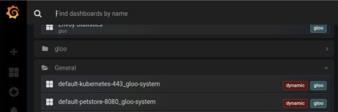
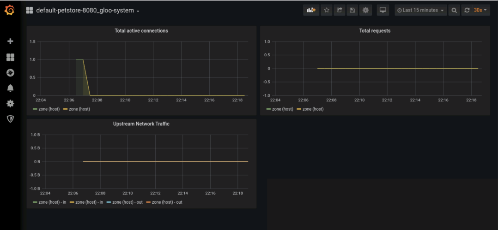
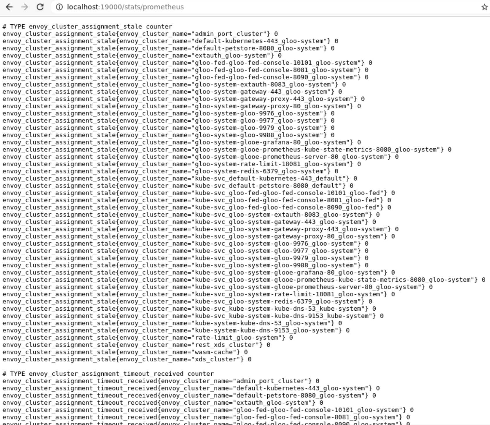
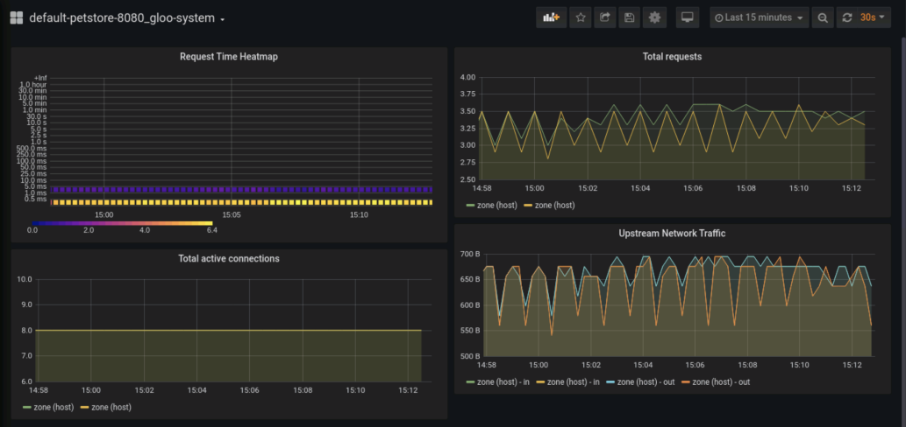
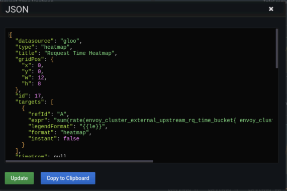

# Custom Dashboards for Envoy Metrics

In this example, we'll be looking at how Gloo Enterprise can support common observability needs when exposing specific Envoy metrics and using that to create a custom dashboard in Grafana. 

We will deploy petclinic as an example application to demonstrate different scenarios with Envoy metrics. 

## Setup

This guide assumes you already have a Kubernetes cluster running, and have installed Enterprise Gloo. 

If you don't yet have access to Enterprise, you can request a 30-day trial license [here](https://lp.solo.io/request-trial). 

We'll install Gloo Enterprise into the `gloo-system` namespace with the default helm values:

```
glooctl install gateway enterprise --license-key $LICENSE_KEY 
```

Once the installation is complete, you should see all of the pods running in the `gloo-system` namespace. We 
are now ready to deploy our application. 

## Deploy the petstore application

For this post, we'll use the petstore application. This is a simple REST API that we'll deploy to the default namespace. 
Gloo's discovery backend will detect the Kubernetes deployment and service were added, and create an upstream 
to represent the destination for traffic. 

First, let's create the petstore resources:

```
kubectl apply -f https://raw.githubusercontent.com/solo-io/gloo/v1.7.5/example/petstore/petstore.yaml
```

Wait until the pods in namespace 'default' are ready. Use `kubectl get pods -n default` to check the status.

Now, we can add a route to Gloo by creating a basic virtual service that looks like this:

```yaml
apiVersion: gateway.solo.io/v1
kind: VirtualService
metadata:
  name: petstore
  namespace: gloo-system
spec:
  virtualHost:
    domains:
      - '*'
    routes:
      - matchers:
          - exact: /pets
        routeAction:
          single:
            upstream:
              name: default-petstore-8080
              namespace: gloo-system
        options:
          prefixRewrite: /api/pets
```

This is a simple route that exposes the API in Gloo. The only feature we've enabled so far is a prefix 
rewrite, so we can expose the API with the desired URI, which we'll use throughout the workflow. 
In the subsequent steps, we'll explore how to turn on 
options on this route. We can apply this route to the cluster with the following command:

```
kubectl apply -f vs-petstore.yaml
```

Finally, let's test the application. We'll use the nested command `%(glooctl proxy url)` to 
determine the http address for the external gateway proxy service, and issue curl commands to our 
route:

```
➜ curl $(glooctl proxy url)/pets
[{"id":1,"name":"Dog","status":"available"},{"id":2,"name":"Cat","status":"pending"}]
```

The API is exposed in Gloo. Now, let's begin exploring the Upstream metrics exposed in Grafana. 

## Grafana Metrics

Gloo Edge automatically captures upstream metrics for you, so let's take a look at what's there before modifying anything.

First, we will need to port forward the grafana service.

```
kubectl -n gloo-system port-forward deployment/glooe-grafana 3000
```

Now, pull up the Grafana dashboard on http://localhost:3000.  If this is your first time logging in to Grafana you can use the default credentials admin/admin.  

Select the Home menu from the top of the page.  Gloo Edge adds the dynamic Upstream dashboards into the General section.  There, you should be able to find **default-petstore-8080_gloo-system**.



You should find that there are some default statistics being captured in the dashboard including:

- Total active connections
- Total requests
- Upstream Network Traffic



Let's go back to a terminal window and send some traffic into the application.

```
while true; do 
  curl $(glooctl proxy url)/pets
done
```

It will take roughly 30 seconds (the default) for statistics to update in the graph.  However, you should start seeing an uptick in the graphs.


## Inspecting Envoy Statistics

Gloo Edge also ensures that Envoy proxy statistics are being captured even if they are not readily visible in the default Upstream dashboard.  Let's now take a look at statistics being captured by Prometheus.

First, we will need to create a second port forward to expose Prometheus.

```
kubectl -n gloo-system port-forward deployment/gateway-proxy 19000
```

Let's bring that up in the browser at http://localhost:19000/stats/prometheus.



Envoy provides quite a bit of data here as you can see.  Let's pick one that makes sense to show on our dashboard.

Search for `envoy_cluster_external_upstream_rq_time` histogram metric within this page.  You should see several lines matching the **default-petstore-8080_gloo-system** upstream.  Let's use this to showcase adding metrics to the Upstream dashboard.

## Developing the Dashboard

To see what the dashboard will look like let's keep the traffic running while we develop it.  First, let's dive into what the prometheus stats for a histogram look like coming from Envoy.

If you take a look at the Envoy statistics for `envoy_cluster_external_upstream_rq_time` you will notice that they are scoped by the Upstream name so we can easily find our petstore upstream - `default-petstore-8080_gloo-system`.  Next, you'll notice that the counters come in buckets of time.  The unit of measurement here is in milliseconds.  You can also see a sum and a count metric and this makes it possible to represent the buckets as a percentage of total if we wanted to do quantiles.  

```
envoy_cluster_external_upstream_rq_time_bucket{envoy_cluster_name="default-petstore-8080_gloo-system", le="0.5"} 1
envoy_cluster_external_upstream_rq_time_bucket{envoy_cluster_name="default-petstore-8080_gloo-system", le="1"} 1
envoy_cluster_external_upstream_rq_time_bucket{envoy_cluster_name="default-petstore-8080_gloo-system", le="5"} 1
envoy_cluster_external_upstream_rq_time_bucket{envoy_cluster_name="default-petstore-8080_gloo-system", le="10"} 1
envoy_cluster_external_upstream_rq_time_bucket{envoy_cluster_name="default-petstore-8080_gloo-system", le="25"} 1
envoy_cluster_external_upstream_rq_time_bucket{envoy_cluster_name="default-petstore-8080_gloo-system", le="50"} 1
envoy_cluster_external_upstream_rq_time_bucket{envoy_cluster_name="default-petstore-8080_gloo-system", le="100"} 1
envoy_cluster_external_upstream_rq_time_bucket{envoy_cluster_name="default-petstore-8080_gloo-system", le="250"} 1
envoy_cluster_external_upstream_rq_time_bucket{envoy_cluster_name="default-petstore-8080_gloo-system", le="500"} 1
envoy_cluster_external_upstream_rq_time_bucket{envoy_cluster_name="default-petstore-8080_gloo-system", le="1000"} 1
envoy_cluster_external_upstream_rq_time_bucket{envoy_cluster_name="default-petstore-8080_gloo-system", le="2500"} 1
envoy_cluster_external_upstream_rq_time_bucket{envoy_cluster_name="default-petstore-8080_gloo-system", le="5000"} 1
envoy_cluster_external_upstream_rq_time_bucket{envoy_cluster_name="default-petstore-8080_gloo-system", le="10000"} 1
envoy_cluster_external_upstream_rq_time_bucket{envoy_cluster_name="default-petstore-8080_gloo-system", le="30000"} 1
envoy_cluster_external_upstream_rq_time_bucket{envoy_cluster_name="default-petstore-8080_gloo-system", le="60000"} 1
envoy_cluster_external_upstream_rq_time_bucket{envoy_cluster_name="default-petstore-8080_gloo-system", le="300000"} 1
envoy_cluster_external_upstream_rq_time_bucket{envoy_cluster_name="default-petstore-8080_gloo-system", le="600000"} 1
envoy_cluster_external_upstream_rq_time_bucket{envoy_cluster_name="default-petstore-8080_gloo-system", le="1800000"} 1
envoy_cluster_external_upstream_rq_time_bucket{envoy_cluster_name="default-petstore-8080_gloo-system", le="3600000"} 1
envoy_cluster_external_upstream_rq_time_bucket{envoy_cluster_name="default-petstore-8080_gloo-system", le="+Inf"} 1
envoy_cluster_external_upstream_rq_time_sum{envoy_cluster_name="default-petstore-8080_gloo-system"} 0
envoy_cluster_external_upstream_rq_time_count{envoy_cluster_name="default-petstore-8080_gloo-system"} 1
```

Now, armed with our metrics, let's create a panel to see how we can create a visualization.  Pick the **Heatmap** visualization and set the *Y axis* unit value to milliseconds (ms).  Make sure the *Data format* is set to Time series buckets.  For the display, we will make sure *Show legend*, *Hide zero* and *Show tooltip* are all toggled on.

For the query, we want to make sure we are distributing the buckets over time so we can see when reqests are taking longer, so we will use the following query on the **gloo** datastore.

```
sum(rate(envoy_cluster_external_upstream_rq_time_bucket{ envoy_cluster_name="default-petstore-8080_gloo-system" }[1m])) by (le)
```

Then set the *Legend* field to `{{ le }}` and make sure that the *Format* field is set to Heatmap.  

It may take a minute to start to see the visualization with our changes but once you do see this we can move to the next step.

## Adding it to the Upstream Dashboard ConfigMap

First, let's take a look at what we have created.



Cool!  We've got some nice colors there too and we can see that the traffic is running smoothly. Let's download the JSON so we can add it to the ConfigMap. Use the drop-down menu on the *Request Time Heatmap* panel and select *More..." and then *Panel JSON*.



Now we are going to edit the ConfigMap for the Upstream and add this panel to it.  

```
kubectl edit -n gloo-sytem cm gloo-observability-config
```

Find the **panels** array within the DASHBOARD_JSON_TEMPLATE.  We will add this panel as the first element in the array.
We will need to fix one line in the JSON, and that is our Prometheus query expression.  Because this is a templated ConfigMap, it is deriving the upstream name with `{{.EnvoyClusterName}}`.  So, find the text in the expression with `default-petstore-8080_gloo-system` and change it to the template name.

With this ConfigMap change in place any new upstream that gets added will automatically show the new Heatmap panel.


